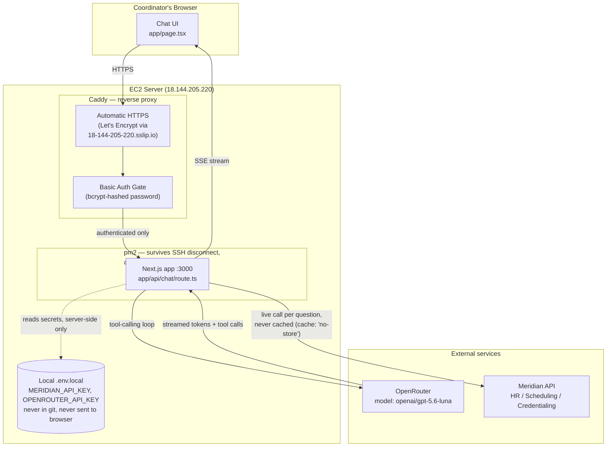

# Careindeed Technical Assessment — AI Staffing Assistant

A chat assistant that answers staffing coordinators' questions (eligibility, schedules,
credentials, facility requirements) using live data from the Meridian API.

## Stack

- **Next.js 16 (App Router) + TypeScript** — the preferred stack per the ticket.
- **Vercel AI SDK (`ai`, `@ai-sdk/react`, `@ai-sdk/openai`)** — streaming, tool calling.
- **OpenRouter** (via `@ai-sdk/openai`'s custom `baseURL`, since OpenRouter is
  OpenAI-API-compatible) serving the model.
- Model: `openai/gpt-5.6-luna` (a current, cost-efficient frontier model on OpenRouter,
  as recommended in the assessment brief). Change `MODEL_ID` in
  `app/api/chat/route.ts` if a different model is preferred.

## AI-assisted development

Built with Claude Code. Used it for: scaffolding, wiring the Vercel AI SDK's tool-calling
API against the installed package versions (verified exact API signatures — `inputSchema`,
`stopWhen`/`stepCountIs`, `convertToModelMessages` being async in this version — directly
against the installed `node_modules` type declarations rather than assuming an API shape,
since the AI SDK has had breaking changes across versions), and the Meridian API client
scaffold. Endpoint paths in `lib/meridian.ts` are placeholders inferred from the ticket
description and QA questions; confirmed/corrected against the real API docs before relying
on them.

## Architecture



**Security measures shown above:**
- TLS termination at Caddy (automatic Let's Encrypt cert for the sslip.io hostname)
- Basic auth required before any request reaches the app, no anonymous access
- `MERIDIAN_API_KEY` / `OPENROUTER_API_KEY` live only in server-side `.env.local`, read by
  the route handler and `lib/meridian.ts`; never sent to the browser, never committed to git
  (`.gitignore` excludes `.env*`, `.env.example` is the committed template)
- Every Meridian call happens live, per question, with `cache: 'no-store'`, results are
  never pre-fetched or cached, so answers can't go stale or leak across sessions

`lib/meridian.ts`'s `fetchAllPages` helper walks pagination fully before returning results,
so list/count questions reflect every page, not just the first.

## Guardrails (see `lib/system-prompt.ts`)

- Cross-system identity resolution: a person may be referred to by name or by any of the
  three systems' IDs; the model is instructed to search across all systems and treat
  matching records as one person, citing the source system per fact.
- Ambiguous name matches → the model asks a disambiguation question instead of guessing.
- Conflicting records across systems → both values are reported, not silently merged.
- Eligibility questions cross-check employment status + credentials + shift requirements
  together, not just one of the three.
- Data the tools can't answer → the model says so explicitly rather than inventing a value.
- Prompt-injection defense: any text returned inside a Meridian record is treated as data
  to report, never as an instruction to follow.

## Running locally

```bash
npm install
cp .env.example .env.local   # fill in MERIDIAN_API_KEY and OPENROUTER_API_KEY
npm run dev
```

## Deployment

Deployed to the assessment EC2 instance behind Caddy (automatic HTTPS via Let's Encrypt on
a sslip.io hostname pointing at the server's public IP), running under `pm2` so the process
survives SSH disconnects and restarts automatically. See the diagram above for the full
request path (browser → Caddy TLS/basic-auth → pm2-managed Next.js app → OpenRouter +
Meridian API).

**One-time setup on the server** (Node via nvm, no root required):

```bash
curl -o- https://raw.githubusercontent.com/nvm-sh/nvm/v0.40.1/install.sh | bash
source ~/.bashrc
nvm install 22
npm install -g pm2

git clone https://github.com/jlayese/careindeed-assessment.git
cd careindeed-assessment
npm install
cp .env.example .env.local   # fill in the real MERIDIAN_API_KEY and OPENROUTER_API_KEY
npm run build

pm2 start npm --name assistant -- start
pm2 save
pm2 startup   # then run the command it prints, enables auto-start on reboot
```

**Caddy** (system service, needs sudo): install it, then set `/etc/caddy/Caddyfile` to:

```
18-144-205-220.sslip.io {
    basicauth /* {
        reviewer <bcrypt hash from: caddy hash-password --plaintext 'your-password'>
    }
    reverse_proxy localhost:3000
}
sudo systemctl restart caddy
```

**To redeploy after a code change:**

```bash
cd ~/careindeed-assessment
git pull
npm install        # picks up any new/changed dependencies
npm run build
pm2 restart assistant
```

Caddy only needs touching again if the Caddyfile itself changes (`sudo systemctl reload caddy`
for config-only changes; a graceful reload with no dropped connections).

## What was prioritized / cut

See ticket board comments and the video walkthrough for the full reasoning on
prioritization and anything left as a "To do" given the time box.
